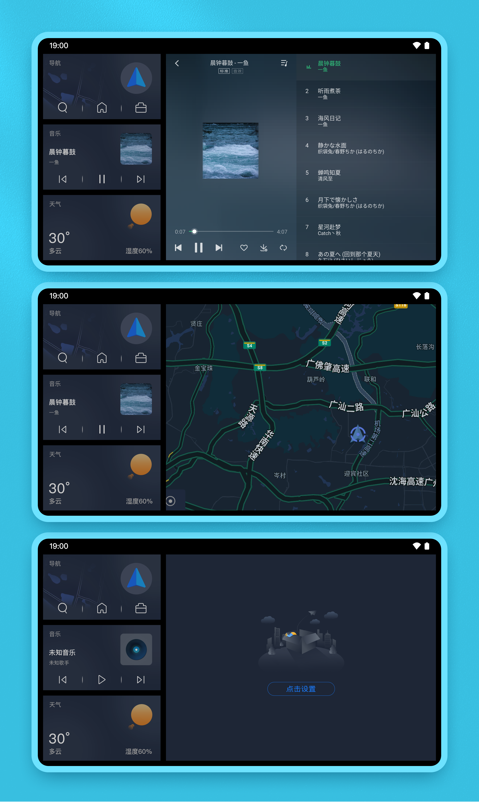

# Android minus screen
OKCAR Minus Screen is an application designed for Android devices. It allows users to personalize their minus screen by adding shortcuts to apps, catering to their individual needs and preferences.

## Features

## Technical Implementation
The technical implementation is based on Google's feed screen solution, utilizing the ILauncherOverlay and ILauncherOverlayCallback interfaces. The Launcher as the client side, and OKCAR Minus Screen serves as an independent application on the server side. Communication is achieved through AIDL, enabling the initialization of the minus screen and the move between the minus screen and the desktop.

## License
[GNU GPLv3](LICENSE)

---

# Android minus screen
OKCAR负一屏是一个用于自定义 Android 设备主屏幕的应用程序。它允许用户自定义自己的负一屏，添加快捷方式，以满足用户的个人需求和喜好。

## 功能特点

## 技术实现
技术原理是采用了Google的feed屏方案，基于ILauncherOverlay和ILauncherOverlayCallback这两个接口来实现，桌面作为客户端，OKCAR负一屏是一个独立应用作为服务端，通过AIDL做通信，来实现负一屏的加载以及负一屏和桌面之间的相互滑动。

## 许可证
[GNU GPLv3](LICENSE)
